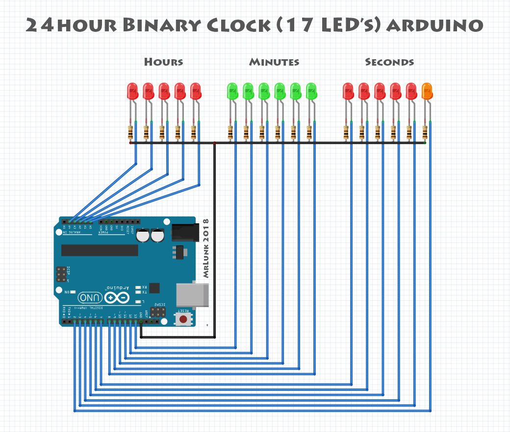

# Binary-visualized clock

In this project, a clock is to be developed which displays the time in binary notation. The clock should use to format hh:mm:ss. Additionally, a countdown mode should be integrated.

## Hardware components

* Arduino UNO & Genuino UNO
* 17 x LED
* 17 x Resistor 100 ohm

## Design Phase

- [x] Forming of groups of two and Selection of one topic in the Moodle task above
- [ ] Breaking down of the topic to well defined requirements, see Requirements Engineering
- [x] Prepare yourself to work with the Arduino and electronics, as far as needed for your topic
- [ ] Design a first schematic of your circuit
- [ ] Summarize a list of required components (active, passive, cables, ...)
- [x] Create a public git (GitHub) repository or private repository on university Gitlab for your project
- [ ] Upload your requirements and schematic to the repository

## Implementation

- [ ] working hardware and software implementation
- [ ] commented and correctly formatted source code
- [ ] uploaded source code on GitHub
- [ ] detailed README.md in your repository
